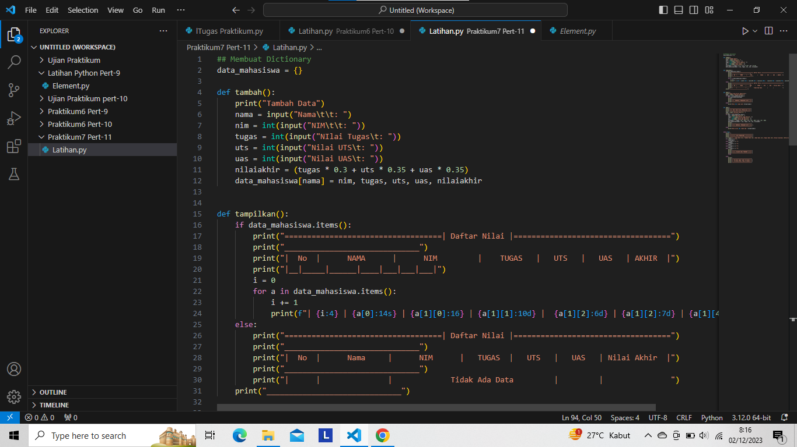
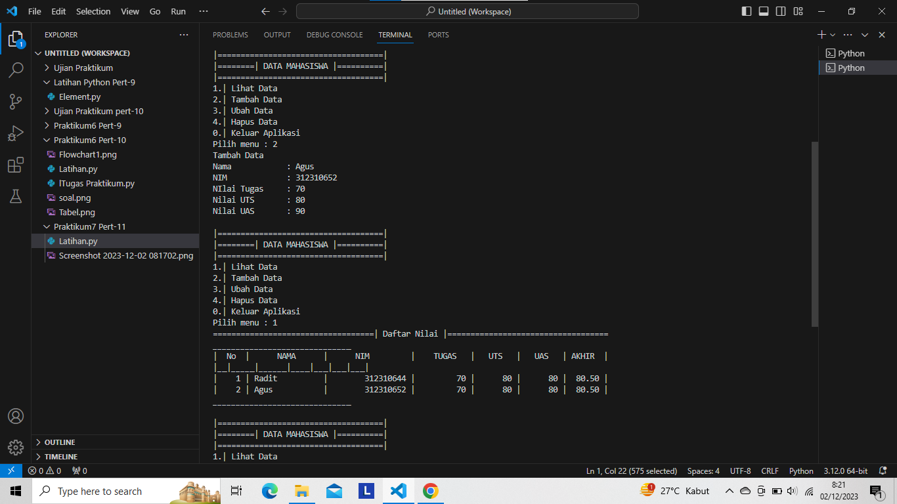
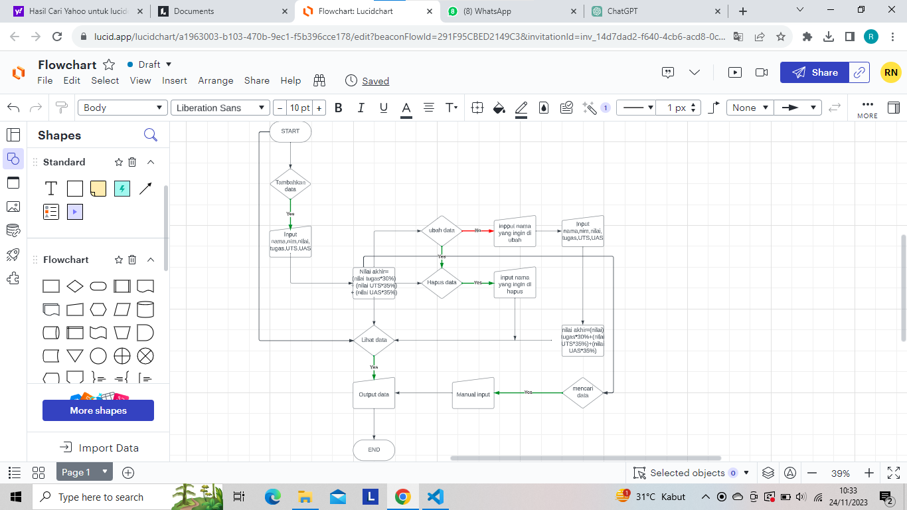

# Labspy07

data_mahasiswa = {}

def tambah():

print("Tambah Data")

nama = input("Nama\t\t: ")

nim = int(input("NIM\t\t: "))

tugas = int(input("NIlai Tugas\t: "))

uts = int(input("Nilai UTS\t: "))

uas = int(input("Nilai UAS\t: "))

nilaiakhir = (tugas * 0.3 + uts * 0.35 + uas * 0.35)

data_mahasiswa[nama] = nim, tugas, uts, uas, nilaiakhir
def tampilkan():

if data_mahasiswa.items():

    print("===================================| Daftar Nilai |===================================")
    
    print("______________________________")
    
    print("|  No  |      NAMA      |      NIM         |    TUGAS   |   UTS   |   UAS   | AKHIR  |")
    
    print("|__|_____|______|____|___|___|___|")
    
    i = 0
    
    for a in data_mahasiswa.items():
    
        i += 1
        
        print(f"| {i:4} | {a[0]:14s} | {a[1][0]:16} | {a[1][1]:10d} |  {a[1][2]:6d} | {a[1][2]:7d} | {a[1][4]:6.2f} | ")
        
else:

    print("===================================| Daftar Nilai |===================================")
    
    print("______________________________")
    
    print("|  No  |      Nama     |      NIM      |   TUGAS  |   UTS   |   UAS   | Nilai Akhir  |")
    
    print("______________________________")
    
    print("|      |               |             Tidak Ada Data         |         |               ")
    
print("______________________________")
def hapus():

print("Hapus Data Nilai Mahasiswa")

nama = input(" Masukan Nama\t:")

if nama in data_mahasiswa.keys():

    del data_mahasiswa[nama]
    
    print()
    
    print("=================================")
    
    print("===| BERHASIL MENGHAPUS DATA |===")
    
    print("=================================")
    
else:
    print("Data {0} tidak ada".format(nama))
def ubah():

print("===================================")

print("===| Edit Data Nilai Mahasiswa |===")

print("===================================")

nama = input("Masukan Nama\t\t: ")

print("_____________")

if nama in data_mahasiswa.keys():

    nim = input("NIM baru\t\t: ")
    
    tugas = int(input("Nilai Tugas Baru\t: "))
    
    uts = int(input("Nilai UTS Baru\t\t: "))
    
    uas = int(input("Nilai UAS Baru\t\t: "))
    
    nilaiakhir = (tugas * 30 / 100 + uts * 35 / 100 + uas * 35 / 100)
    
    data_mahasiswa[nama] = nim, tugas, uts, uas, nilaiakhir
    
    print()
    
    print("================================")
    
    print("====| BERHASIL MENGUBAH DATA |====")
    
    print("================================")
    
else:

    print("Data nilai {0} tidak ada ".format(nama))
while True:

print("")

print("|====================================|")

print("|========| DATA MAHASISWA |==========|")

print("|====================================|")

x = input("1.| Lihat Data \n2.| Tambah Data \n3.| Ubah Data \n4.| Hapus Data \n0.| Keluar Aplikasi \nPilih menu : ")

if x.lower() == "1":

    tampilkan()
    
elif x.lower() == "2":

    tambah()
    
elif x.lower() == "3":

    ubah()
    
elif x.lower() == "4":

    hapus()
    
elif x.lower() == "0":

    print()
    
    print("=================================")
    
    print("====== KELUAR DARI PROGRAM ======")
    
    print("=================================")
    
    break

else:

    print()
    
    print("================================")
    
    print("== Pilihan Anda Tidak Tersedia ==")
    
    print("== Pilihlah Menu Yang Tersedia ==")
    
    print("================================

